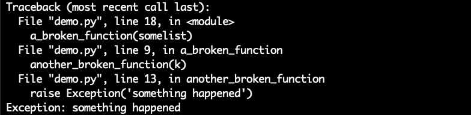
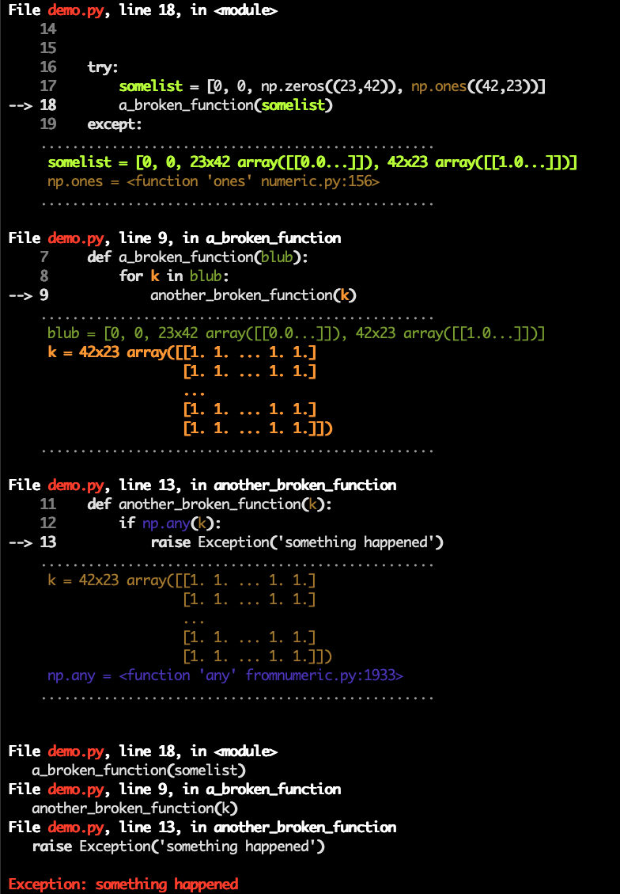
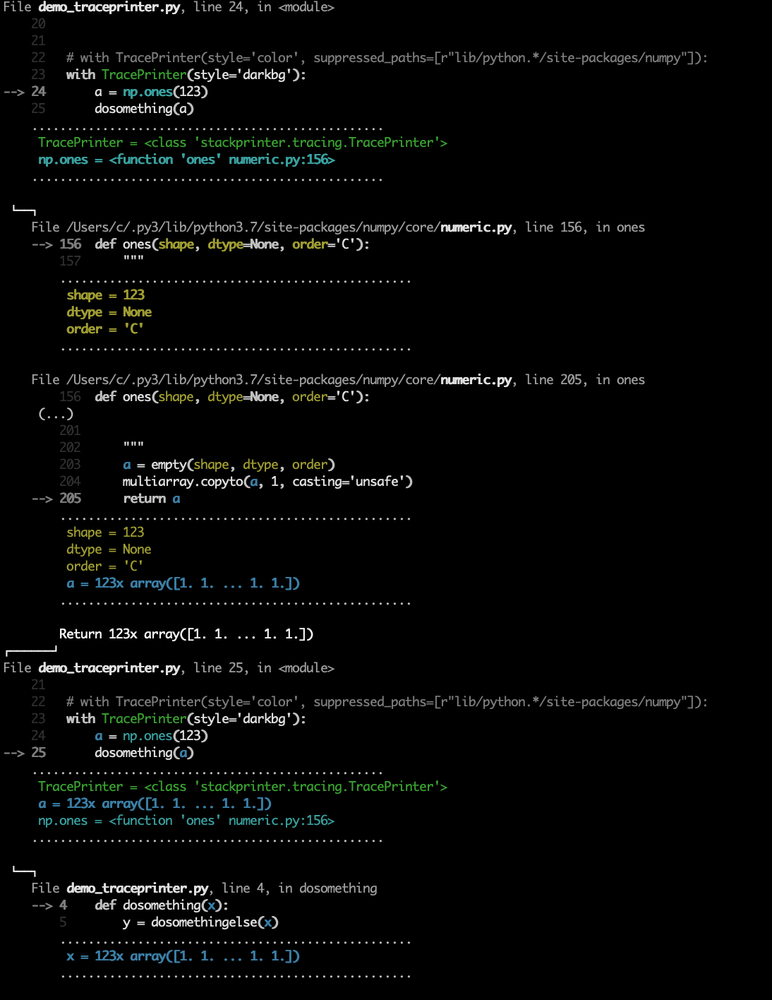

## Python stack formatter

This prints detailed Python stack traces, with some more source context and with current variable contents. It's a quick way to see what your code is doing when you don't have an IDE or even a debugger for some reason, e.g. when your only debugging tool is a log file 😱

#### Before


#### After


# Usage

## Log exceptions
Call `show` or `format` in an except block to generate a traceback. `show` prints to stderr, `format` returns a string.

By default, both will generate plain text. Pass `style='color'` to get some semantic highlighting. See the docs of `format` to configure exactly _how_ verbose everything should be, blacklisting certain file paths etc.

```python
import stackprinter

try:
    something()
except:
    stackprinter.show()  # grab the current exception and print it to stderr

    # ...or only return a string, e.g. for logging.
    message = stackprinter.format()
    logging.log(message)
```
Alternatively, there's `stackprinter.set_excepthook` which replaces the default python crash message (so it works automatically without manual try/except... unless you're in IPython).

You can also pass things like exception objects explicitely (see docs).

## See the current call stack of another thread
Pass a thread object to `show` or `format`.

```python
thread = threading.Thread(target=something)
thread.start()
while True:
    stackprinter.show(thread) # or format(thread)
    time.sleep(0.1)
```

## See the call stack of the current thread
Call `show` or `format` outside of exception handling.

```python
stackprinter.show() # or format()
```

## Trace a piece of code as it is executed

More for curiosity than anything else, you can watch a piece of code execute step-by-step, printing a trace of all function calls & returns 'live' as they are happening. Slows everything down though, of course.
```python
tp = stackprinter.TracePrinter(style='color', suppressed_paths=[r"lib/python.*/site-packages/numpy"])
tp.enable()
a = np.ones(111)
dosomething(a)
tp.disable()
```



# How it works

Basically, this is a frame formatter. For each [frame on the call stack](https://en.wikipedia.org/wiki/Call_stack), it grabs the source code to find out which source lines reference which variables. Then it displays code and variables in the neighbourhood of the last executed line.

Since it knows exactly where each variable occurs in the code, it was hard not to add the whole semantic highlighting thing. It's more a coincidence though that these colors are rendered via 1980ies terminal technology (ANSI color codes). It shouldn't be too difficult to write other formatter types on top of the underlying inspection routines. Say, foldable and clickable HTML pages, with download links for pickled variables?

# Caveats

This displays variable values as they are _at the time of formatting_. In
multi-threaded programs, variables can change while we're busy walking
the stack & printing them. So, if nothing seems to make sense, consider that
your exception and the traceback messages are from slightly different times.
Sadly, there is no responsible way to freeze all other threads as soon
as we want to inspect some thread's call stack (...or is there?)

# Docs

\*coughs\*

For now, look at the doc strings, e.g. https://github.com/cknd/stackprinter/blob/refactor/stackprinter/__init__.py#L28-L95
